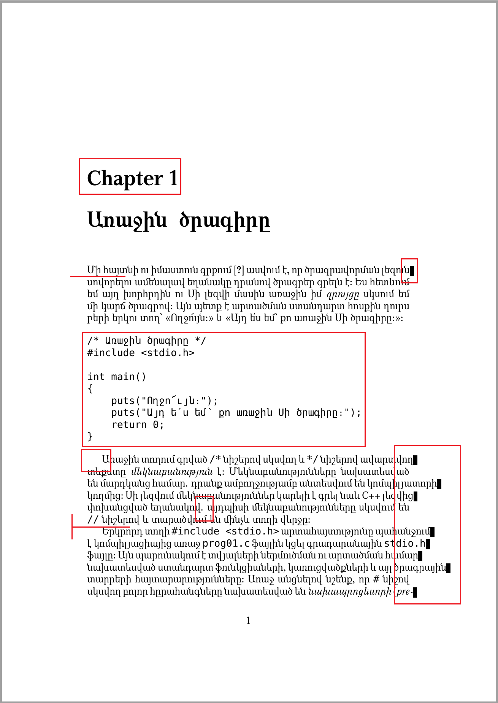
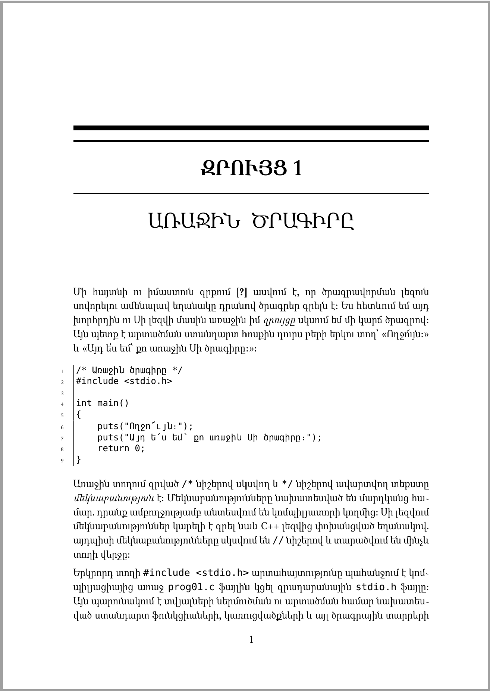

# Գեղեցիկ գրքերի մասին

> Այն մասին, թե ինչպե՛ս այս լուսավոր ու առաջադեմ դարում գրել ու ձևավորել գեղեցիկ տեխնիկական գրքեր։

Ամեն անգամ, երբ լսում եմ, որ հրատարակվել է ինֆորմատիկային կամ ծրագրավորմանը վերաբերող որևէ հայերեն գիրք, ուրախանում եմ, որ վերջապես մեր մասնագետներն էլ են սկսել իրենց գիտելիքները փոխանցել գրքի տեսքով։ Ոչ թե բլոգի գրառման, ոչ թե տեսագրության եղանակով, այլ հատկապես գրքի տեքսով, քանի որ գրքի հրատարակությունը ենթադրում է ներկայացվող նյութի համակարգվածություն և հանգամանալից ուսումնասիրություն։ Եթե բլոգի գրառման մեջ կամ տեսադասում հեղինակը կարող է թույլ տալ ինչ-որ անճշտություններ և որոշ ժամանակ հետո դրանք ճշտել, ապա գրքի դեպքում դա ընդունելի չէ։ Ոչ միայն այն պատճառով, որ գիրքը նաև տպագրական ծախս է, և դժավար ու ձեռնտու չէ կարճ ժամանակում նորից այն վերահրատարակել։ Սխալներն ընդունելի չեն նաև էլեկտրոնային գրքերում. նորից այն հիմնավորմամբ, որ գիրք, այնուամենայնիվ, նյութի մատուցման մի ավելի բարձր մակարդակ է։

Բայց գիրքը, լինի դա թղթին տպված կամ թվանշանային տեսքով, միայն տեղեկույթի, գիտելիքի փոխանցման միջոց չէ։ Իմ կարծիքով, գիրքը պետք է նաև գեղագիտական տեսակետից ճիշտ կազմակերպված լինի։ Ավելի պարզ ասած՝ երբ գրախանութում ձեռքս եմ վերցնում գիրքը ու բացում եմ պատահական մի էջ, ապա հենց այդ առաջին տպավորությունն է հաճախ որոշիչ լինում գիրքը գնելու, հետո նաև կարդալու համար։ Եթե տեքստում իրար են խառնված մի քանի տպատառեր, եթե գծապատկերները կամ նկարները աչքի համար ոչ հաճելիորեն չափի են, կապ վատ են տեսադրված տեքստում, եթե ծրագրի կոդը... Կարճ ասած, եթե գրքի էջի տեսքն ակնահաճո չէ, ապա ես չեմ էլ մտածում բովանդակության մասին։ Ավելի ճիշտ՝ մտածում եմ, որ բովանդակությունն էլ նույն կերպ փնթի է լինելու։ Որևէ մեկի աշխատանքը չթերագնահատելու կամ որևէ մեկին չնեղացնելու համրա չէի ուզում օրնակ բերել, բայց նաև չեմ կարող չհիշատակել այս «հուշարձանը». [_Տվյալների կառույցներ_](http://publishing.ysu.am/hy/1425454116)։

Կան, իհարկե լավ օրինակներ։ Յու. Հակոբյանի [_Թվային մեթոդները_](http://publishing.ysu.am/hy/1516710042), կամ Վ. Միքայելյանի [_Ալգորիթմական հանրահաշիվը_](http://publishing.ysu.am/hy/1445508482) այն քիչ գրքերից են, որոնցում զգացվում է, որ հեղինակը խնամքով ու հոգատարությամբ է մոտեցել ինչպես տեքստի բովանդակությանը, այնպես էլ արտաքին տեսքին։ Ես բախտ եմ ունեցել լսելու թե՛ պրոֆ. Հակոբյանի, թե՛ պրոֆ. Միքայելյանի դասախոսությունները, և կարող եմ վստահ ասել, որ նրանց մասնագիտական որակները պարզապես թույլ չէին տա այլ տիպի գրքեր գրել։

Լա՛վ, ի՞նչ անել։ Արդյո՞ք եթե ոչ _ճիշտ_, ապա գոնե _գեղեցիկ_ գիրք պատրաստելու համար մարդս պետք է խորությամբ տիրապետի տպագրական հմտություններին։ Կարծում եմ, որ ո՛չ։ մեր օրերում կան տեքստերի մշակման ավտոմատացված համակարգեր, որոնք նախապես կարգավորված են տպագրական ստանդարտներով, և, բայցի այդ, հնարավորություն են տալիս հեշտությամբ լրացնել ու ձևափոխել այդ կարգավորումները՝ կամայական ճաշակ բավարարելու համար։ Բայց, այնուամենայնիվ, ավելորդ չի լինել կարդալ Jan Tschichold-ի _Ausgewählte Aufsätze über Fragen der Gestalt des Buches und der Typographie_ գիրքը (ռուս. Ян Чихольд, _Облик книги: избранные статьи о книжном оформлении_):

Որպեսզի «ճառ ասողի» տպավորություն չթողնեմ և քննադատությունս էլ անհիմն չլինի, ես մի գրքի օրինակով ցույց կտամ, թե ինչպես եմ կառուցում, իմ կարծիքով, _գեղեցիկ_ գիրք։

Նորից նշեմ, որ խոսքը _տեխնիկական_ գրքերի մասին է. առաջին հերթին՝ ծրագրավորում, ապա՝ մաթեմատիկա, ֆիզիկա եւ այլն։ Եվ, բնականաբար, ես խոսելու եմ TeX և LaTeX քոմփյութերային հրատարակչական համակարգերի համատեքստում։ Որպես TeX/LaTeX իրականացում օգտագործելու եմ XeTeX-ը. սա աշխատում է UTF-8 տեքստերի հետ, օգտագործում է համակարգում տեղադրված TTF տառատեսակները, գեներացնում է PDF արդյունք։

Ուրեմն, ես ուզում եմ տպագրության պատրստել Սի (C) ծրագրավորման լեզվի հիմունքների մասին մի գիրք։ Այն մոտավորապես ունենալու է 120 էջ (միգուցե մի քանի էջ ավելին՝ հավելվածների համար)։ Գիրքը լինելու է հայերեն, տեքստը պարունակելու է ծրագրային կոդ, ալգորիթմների նկարագրություն, լեզվի շարահյուսական տարրերի նկարագրություն, գծապատկերներ։ Նաև՝ կազմ, տիտղոսաթերթ, բովանդակային, առարկայական ու գրականագիտական ցանկեր։

Գրքերի պատրաստման համար LaTeX-ն առաջարկում է report և book դասերը (մակետները)։ report-ը ավելի պարզ ու փոքրածավալ գրքերի համար է, որոնք, օրինակ բաղկացած են միայն գլուխներից։ book-ը ավելի բարդ գրքերի համար է՝ բաղկացած մասերից, գլուխներից ու ենթագլուխներից, նախաբանից, հավելվածներից, ցանկերից և այլն։ memoir դասը, որը LaTeX-ի ստանդարտ փաթեթի մեջ չի մտնում, գրքի ձևավորման է՛լ ավելի բազմազան հնարավորություններ է տրամադրում, օրինակ, էջի չափի, տառատեսակների, վերնագրերի ոճերի համար։ Բոլոր այս դասերն արդեն իսկ կարգավորված են տպագրական ստանդարտներին համապատասխան։

Իմ գրքի գլխավոր ֆայլն անվանել եմ `vcl-book.tex` (պատմական պատճառներով): Այս ֆայն է պարունակում բոլոր կարգավորումները և սրան են կցված գրքի գլուխների տեքստը պարունակոց ֆայլերը. `\input` հրամանով, բայց այս մասին ավելի ուշ։ Ֆայլի առաջին տողում մակետի ընտրության `\documentclass` հրամանն է։ Քանի որ գրքի ծավալը փոքր է՝ ես սկզբնական տարբերակում կօգտագործեմ report դասը։

```LaTeX
\documentclass[a4paper,12pt,draft]{report}

\begin{document}

\end{document}
```

Քառակուսի փակագծերի մեջ տրված `a4paper`-ը ընտրում է A4 չափի էջը, `12pt`-ը ընտրում է տեքստի հիմնական տառաչափը, մյուս տառերի չափը՝ վերնագրերի, ենթավերնագրերի, էջատակի նշումների համար ընտրվում է սա հետ համամասնությամբ։ `draft` պարամետրը միացնում է սևագրության ռեժիմը, երբ, օրինակ, նշվում են չհաջողված տողադարձերը, արտածվում են լուսանցքների նշումները (`\marginpar`-ով տրված), իսկ գրաֆիկական օբյեկտների փոխարեն արտածվում է դրանց չափը ցույց տվող ուղղանկյուն։

`\documentclass`-ից մինչև `\begin{document}` հատվածում գրվում են կառուցվելիք գրքի/փաստաթղթի կարգավորումները, իսկ `\begin{document}`-ից `\end{document}` տողերի արանքում գրվում է այն բովանդակությունը, որն արտածվելու է որպես արդյունք։

Գրքի տեքստի համար օգտագործելու եմ ՂԷԱ Մարիամ և ՂԷԱ Գրապալատ տպատառերը, իսկ Սի լեզվով գրված ծրագրերի կոդի կամ առանձին բաղադրիչների համար՝ DejaVu Sans Mono տպատառերը։ Համակարգում տեղադրված տպատառերն օգտագործելու համար ընտրում եմ `fontspec` փաթեթը՝ `\documentclass` հրամանից հետո գրելով.

```LaTeX
\usepackage{fontspec}
```

Հիմնական (serif) տառատեսակն ընտրվում է `\setmainfont` հրամանով՝ արգումենտում տալով տպատառի ֆայլի անունը, Հելվետիկա (sans) տիպի տառատեսակն ընտրվում է `\setsansfont` հրամանով, իսկ միալայնք (mono) տառատեսակն էլ ընտրվում է `\setmonofont` հրամանով։ Այսպես.

```LaTeX
\setmainfont[HyphenChar="058A]{GHEAMariam}
\setsansfont[HyphenChar="058A]{GHEAGrapalat}
\setmonofont{DejaVu Sans Mono}
```

`HyphenChar="058A` պարամետրով նշում եմ, որ տողադարձի համար պետք է օգտագործել ոչ թե սովորական գծիկը, այլ _ենթամնա_ նիշը։

Գործնականում սա արդեն բավական է հայերեն տեքստ պատրաստելու համար, բայց... Բայց LaTeX-ի մակետներում որոշ պարամետրեր ի սկզբանե սահմանված լինելով անգլերենի համար, «հարմար» չեն հայերեն տեքստերին։ Դրանք ավելի հստակ ցուցադրելու համար կառուցեմ գրքի առաջին գլխի առաջին էջը։

Ստեղծում եմ `chapter01.tex` անունով ֆայլը՝ հետևյալ պարունակությամբ։

```LaTeX
\chapter{Առաջին ծրագիրը}

Մի հայտնի ու իմաստուն գրքում \cite{krc} ասվում է, որ ծրագրավորման
լեզուն սովորելու ամենալավ եղանակը դրանով ծրագրեր գրելն է։ Ես հետևում
եմ այդ խորհրդին ու Սի լեզվի մասին առաջին իմ \emph{զրույցը} սկսում
եմ մի կարճ ծրագրով։ Այն պետք է արտածման ստանդարտ հոսքին դուրս բերի
երկու տող՝ «Ողջո՜ւյն։» և «Այդ ե՛ս եմ՝ քո առաջին Սի ծրագիրը։»։

\begin{verbatim}
/* Առաջին ծրագիրը */
#include <stdio.h>

int main()
{
    puts("Ողջո՜ւյն։");
    puts("Այդ ե՛ս եմ՝ քո առաջին Սի ծրագիրը։");
    return 0;
}
\end{verbatim}

Առաջին տողում գրված \verb|/*| նիշերով սկսվող և \verb|*/| նիշերով
ավարտվող տեքստը \emph{մեկնաբանություն} է։ Մեկնաբանությունները
նախատեսված են մարդկանց հա\-մար. դրանք ամբողջությամբ անտեսվում են
կոմպիլյատորի կողմից։ Սի լեզվում մեկնաբանություններ կարելի է գրել
նաև C++ լեզվից փոխանցված եղանակով. այդպիսի մեկնաբանությունները
սկսվում են \verb|//| նիշերով և տարածվում են մինչև տողի վերջը։
```

Իսկ `vcl-book.tex` ֆայլ այս պահին դեռ ունի հետևյալ նվազագույն պարունակությունը.

```LaTeX
\documentclass[a4paper,12pt,draft]{report}
\usepackage{fontspec}

\setmainfont[HyphenChar="058A]{GHEAMariam}
\setsansfont[HyphenChar="058A]{GHEAGrapalat}
\setmonofont{DejaVu Sans Mono}

\begin{document}

\input{chapter01.tex}

\end{document}
```

`xelatex` հրամանով թարգմանում եմ _ձեռագիրը_.

```bash
$ xelatex vcl-book.tex
```

Ու ստանում եմ առաջին գլխի առաջին էջի ահա այսպիսի պատկերը, որի վրա նշել եմ այն բաղադրիչները, որոնք պետք է կարգավորվեն։



Առաջինը `Chapter` բառն է։ Սա արտածվում է, երբ ձեռագրում օգտագործված է գրքի նոր գլուխը սկսող `\chapter` հրամանը։ Պարզ է, որ հայերենի դեպքում սա պետք է փոխարինել `Գլուխ` բառով։ Բայց քանի որ իմ գիրքը կոչվում է «Զրույցներ Սի լեզվի մասին», ապա ես որոշել եմ գլուխներն անվանել «զրույցներ»։ LaTeX-ում `Chapter` բառը սահմանված է `\chaptername` սիմվոլով։ Վերասահմանում եմ այն հետևյալ կերպ.

```LaTeX
% գրքի գլուխները սկսող բառը
\renewcommand{\chaptername}{Զրույց}
```

Նույն կերպ վերասահմանում եմ գրքի մյուս բաղադրիչների վերնագրերի սիմվոլները։ Հետևյալներից ամեն մեկի մասին առանձին կխոսեմ րենց տեղում։

```LaTeX
% բովանդակության ցանկի վերնագիր
\renewcommand{\contentsname}{Բովանդակություն}
% նկարների/պատկերների պիտակ
\renewcommand{\figurename}{Նկար}
% աղյուսակների պիտակ
\renewcommand{\tablename}{Աղյուսակ}
% հավելվածների վերնագիր
\renewcommand{\appendixname}{Հավելված}
% գրականության/հղումների ցանկ
\renewcommand{\bibname}{Գրականություն}
% առարկայական ցանկի վերնագիր
\renewcommand{\indexname}{Առարկայական ցանկ}
```

Հաջորդը միջտողային հեռավորությունն է։ Քանի որ լատինական փոքրատառերը հիմնականում տողից կախված մասնիկներ չունեն (այդպիսին են միայն g, j, p, q, y տառերը), իսկ հայերեն փոքրատառերից հիմնականում բոլորն ունեն տողից կախված մաս, հայերեն տեքստերում միջտողային հեռավորությունը մեծացնում եմ 20%-ով։ Այսպես.

```LaTeX
\linespread{1.2}
```

Էջի որոշ տողերի վերջում փոքրի սև ուղղանկյուն է դրված։ Դրանով նշված են այն տողերը, որոնցում բառը դուրս է եկել էջի սահմաններից, իսկ TeX-ը չի կարողացել տողադարձ անել։ Ընդհանրապես, տողադարձը հայերեն տեքստերի թույլ տեղն է. ես դեռ չեմ հանդիպել TeX-ի տողադարձի կանոններ հայերենի համար։ Այդ պատճառով էլ ստիպված եմ բառերի մեջ տողադարձերի տեղերը բացահայտ նշել։ Սակայն մի ճշգրտում էլ. հայտնի է, որ հայերենում բառերի միջին երկարությունը ավելին է քան անգլերենում, ես TeX-ի «համբերության» պարամետրը մի քիչ կմեծացնեմ, որպեսզի պակասեցնեմ ողադարձի անհրաժեշտությունը.

```LaTeX
\tolerance=1500
```

Հետո արդեն բառի մեջ տողադարձը նշում եմ `\-` նիշերով, իհարկե, ճիշտ վանկատելով բառը։ Օրինակ, հետևյալ պարբերության մեջ մի քանի բառերում նշված են տողադարձերի թույլատրելի տեղերը.

```LaTeX
Առաջին տողում գրված \verb|/*| նիշերով սկսվող և \verb|*/| նիշերով
ավարտ\-վող տեքստը \emph{մեկնաբանություն} է։ Մեկնաբանությունները
նախատես\-ված են մարդկանց հա\-մար. դրանք ամբողջությամբ անտեսվում են
կոմպիլյատորի կողմից։ Սի լեզվում մեկնաբանություններ կարելի է գրել
նաև C++ լեզվից փոխանցված եղանակով. այդպիսի մեկնաբա\-նությունները
սկսվում են \verb|//| նիշերով և տարածվում են մինչև տողի վերջը։
```

Անգլերենում վերջակետից հետո (`.`) դրվում է մի փոքր ավելի մեծ չափի բացատ, քան այլ կետադրական նիշերից հետո։ Բայց քանի որ հայերենում կետն օգտագործվում է որպես միջակետ, ես `\frenchspacing` հրամանով TeX-ից պահանջում եմ կետից հետո էլ սովորական բացատ թողնել։

Մնաց կոդի բլոկը։ Սրա համար ես օգտագործելու եմ [fancyvrb](https://ctan.org/pkg/fancyvrb?lang=en) փաթեթը, որն ինձ թույլ է տալիս ավելի նուրբ կարգավորումներ անել կոդի բլոկներում։ Կարգավորման հրամանն այսպիսինն է. տողերի համարակալումը ձախից, տառաչափը՝ `\small`, իսկ միջտողային հեռավորությունը՝ միավոր.

```LaTeX
\RecustomVerbatimEnvironment{Verbatim}{Verbatim}%
{numbers=left,fontsize=\small,baselinestretch=1}
```

Կարելի է ասել, որ հայերեն տեքստերի համար կարգավորումների առաջին մոտեցումը լրիվ է։ Արդեն կարելի է կառուցել գրքի գլուխները։ Բայց գիրքը միայն գլուխների տեքստից չէ բաղկաած։ Ինչպես նշեցի սկզբում, գիրքը պետք է համալրել տիտղոսաթերոթվ, զանազան ցանկերով, գծապատկերներով ու, վերջապես, կազմով կամ շապիկով։ Բայց մինչև դրանց անցնելը ես պետք է մի քանի փոքր կարգավորում էլ անեմ. իմ աչքին ավելի հարմար է թվում, երբ տեքստի պարբերությունները սկսվում են ոչ թե «մի մատ խորքից», այլ հենց տողի սկզբից, իսկ երկու պարբերությունների միջև մի քիչ ավելի մեծ ուղղահայաց բացատ կա, քան պարբերության տողերի միջև է։ Այսպես.

```LaTeX
\setlength{\parindent}{0pt}
\setlength{\parskip}{6pt plus 2pt minus 1pt}
```

Մյուսը. նորից իմ աչքին ավելի հարմար են թվում մի փոքր ավելի նեղ լուսանցքները։ `geometry` փաթեթով սահմանում եմ էջը շրջապատող լուսանցքների չափերը. վերևից ու աջից մեկ մատնաչափ, ներքևից ու ձախից՝ 1.2։

```LaTeX
\usepackage[top=1in,bottom=1.2in,left=1.2in,right=1in]{geometry}
```

Ընդհանրապես ընդունված է, որ մարդու աչքը կարդալիս չի հոգնում եթե տողում 60-65 նիշ է։ Էջի ու լուսանցքների չափը դնելիս սա նույնպես պետք է հաշվի առնել։

Ու վերջապես, ես ուզում եմ փոխել գրքի գլուխների վերնագրերը ցույց տալու ձևը։ Դրա համար օգտագործում եմ `fncychap` փաթեթը՝ `Conny` պարամետրով։

```LaTeX
\usepackage[Conny]{fncychap}
```

(Համարյա) վերջնական պատկերն այսպիսինն է.


