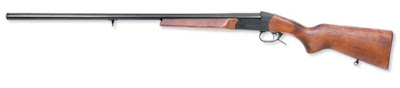
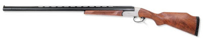
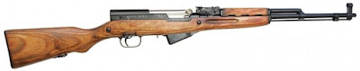
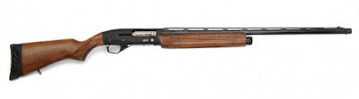
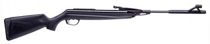
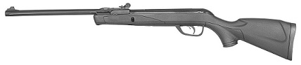
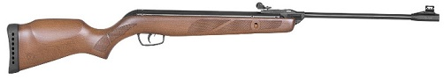

# Մեր հրացանները

_Ազատազէնը_ մի շատ լավ նախաձեռնություն է սկսել. «Թվանք» շարքում մարդիկ պատմում են իրենց հրացանների մասին։ Տեսանյութ նկարելու ես անշնորհք եմ ու այդ պատճառով էլ մեր ընտանիքի հրացանների մասին կպատմեմ այս գրառման մեջ։

2016 թվականի ընթացքում Արցախում Երեւանում տեղի ունեցած անցքերն ամրապնդեցին այն համոզմունքը, որ ամեն մի հայկական, թերեւս ավելի ճիշտ՝ հայաստանյան, ընտանիքում պետք է զենք լինի ու լինի զինամթերքի նվազագույն պաշար։ Եւ ընտանիքի անդամներն էլ պետք է գոնե տարրական գիտելիքներ ունենան զենքի կիրառման, դրա հետ անվտանգ վարվելու մասին։

Քանի որ առաջին անգամն էի զենք գնելու, ուրեմն կարող էի գնել միայն հարթափող տեսակը։ Բացի այդ, ուզում էի ընտրել նաեւ հնարավորինս էժան տարբերակ։ Մի քանի խանութներ մտա, հացուփորձ արեցի, ձեռքիս մեջ շուռումուռ տվեցի ցուցադրված հրացանները ու կանգ առա երեք օրինակի վրա։

__Առաջին__, ամենաէժանը Բայկալ ֆիրմայի MP-18-ն էր, կամ դրա Sporting (սպորտային) տարբերակը։

 Սա, իհարկե հարմար է որսի կամ, որոշ վերապահումներով, սպորտային հրաձգության համար, բայց, իմ կարծիքով, ընդհանրապես հարմար չէ որպես ինքնապաշտպանական զենք։

__Երկրորդ__, մի քիչ ավելի թանկ տարբերակը պատմական СКС-ն էր (Самозарядный карабин Симонова)։

 Այս կարաբինը շատ հարմար է, թե որսի (որի նպակակը ես չունեի), թե հրաձգություն սովորելու, եւ թե որպես ինքնքպաշտպանական զենք։ Բայց սա ակոսավոր զենք է, որը գնելու իրավունքը չունեի, իսկ ծանոթով կամ կաշառքով թույլտվություն ձեռք գցելու համար պնդերեսությանս պաշարը չհերիքեց։ Այս տարբերակն էլ մի կողմ դրեցի։

__Երրորդը__ նույն Բայկալ ֆիրմայի MP-155-ն էր, որը տվյալ պահին հենց այն էր, ինչ ես ուզում էի։ 

Հարթափող. ոչ մի խնդիր չի առաջանում որպես առաջին զենք գնելու համար, կիսաավտոմատ. շատ հարմար է որպես ինքնքպաշտպանական զենք, իրար հետեւից հինգ կրակոց արձակելու համար, տրամաչափը. ամենատարածված 12 տրամաչափը, որը թույլ է տալիս ընտրել փամփուշտների շատ լայն տեսականի, հեռահարություն. հարթափող զենքի համեմատաբար կարճ հեռահարությունը հնարավորություն է տալիս հրաձգությամբ պարապել գործնականում ցանկացած տեղ՝ ընտրելով բնակավայրից օրենքով նախատեսված նվազագույն հեռավորություն ու ապահով տեղ։ Կարճ ասած, սա ամենահարմար տարբերակն էր ու ընտրեցի հենց Բայկալ MP-155-ը։

Հավաքեցի փաստաթղթերը. տեղեկանք պոլիկլինիկայից, պետակքն տուրքի կտրոններ եւ այլն ու գնացի «Ասպար» խանութ։ Հենց տեղում ընդունվեցի որսորդների ու հրաձիգների միություն՝ համապատասխան վճարով ու տարեկան անդամավճարով։ Աշխատողը պահեստից բերեց հրացանը, գրանցեց համարը ու ասաց, որ պետք է ձեւակերպված թղթերը տանեմ ոստիկանության բաժանմունք հաստատելու եւ զենք կրելու թույլտվություն ստանալու։ Խանութի տված համարով զանգեցի, անմիջապես անցաթուղթ տվեցին ու բարձրացա արդեն չեմ հիշում, թե բաժին։ Ընդունեց մի գնդապետ, շատ քաղաքավարի բացատրեց իմ իրավունքներն ու պարտականությունները, մի քանի հարց տվեց ու ասաց, որ պատրաստի փաստաթղթերը կուղարկեն խանութ։ Երկու օր հետո խանութից զանգեցին ու ասացին, որ ամեն ինչ պատրաստ է, կարող եմ գնալ, վճարել ու վերցնել հրացանը։

Հրացանը վերցնելիս գնեցի նաեւ մի տուփ յոթերորդ համարի կոտորակով փամփուշտ. պարզապես կրակելու եւ հրացանը զգալու համար։ Հենց առաջին կրակոցները ցույց տվեցին, որ շատ լավ գործիք եմ ընտրել։ MP-155-ը, ընկուզենու փայտով տարբերակը, շատ հարմար հրացան է. ձայնը կոպիտ չէ, հետահարվածը շատ ուժեղ չէ, փամփուշտների նկատմամբ պահանջկոտ չէ, A4 թղթի կենտրոնից քիչ ցածր նշան բռնելիս կոտորակների մեծ մասը հավասարաչափ փռվում են թղթի մակերեսին։ Դետալների խոսորության ու քչության շնորհիվ քանդելն ու մաքրելը շատ հեշտ է։ (Արժե նշել, որ հրացանի որոշ դետալներ կարծես թե տաշված են ոչ թե ֆրեզերային կամ խառատային հաստոցով, այլ պարզապես խարտոցով։ Ես ստիպված եղա որոշ շտկումներ անել մանր ատամներով խարտոցով, որպեսզի դետալների շփումն ավելի «հանգիստ» լինի։ Բայց, հաշվի առնելով գինը, այդ որակը լրիվ ընդունելի է. ի վերջո՝ Բայկալը Բենելլի չէ։)

Հետագայում գնեցի տարբեր տեսակի փամփուշտներ ու դրանցով էլ փորձարկեցի հրացանի հեռահարությունն ու ճշգրտությունը։ Կարող եմ ասել, որ ինքնապաշտպանության համար, եթե հաշվի առնենք «աշխատանքային հեռավորությունը»՝ 25-50 մետր, փորձարկումներիս արդյունքներն ավելի քան գոհացնող են։ Ես որպես հիմնական, ամենօրյա փամփուշտ ընտրել եմ խոշոր կոտորակ (օրինակ, 00, 000 կամ 0000 համարները) կամ 6.5մմ կարտեչ, կարծում եմ, որ դրանք ամենահարմարն են իմ՝ վերը նշած նպատակի համար։ Հիմա չհրկիզվող պահարանում մշտապես պահում եմ մոտ հարյուր փամփուշտ, կարելի է ասել՝ որպես «անձեռնմխելի պաշար»։

__* * *__

Անցած աշնանը որոշեցինք օդամղիչ հրացան գնել։ Մի քանի պատճառներով. նախ՝ հրազենով պարապելու հարմար հրաձգարաններ չկան, երկրորդ՝ իմ հրացանը պահում եմ գյուղում, քանի որ այնտեղ այն ավելի պետք է, երրորդ ու ամենակարեւորը՝ ես ուզում եմ, որ իմ յոթ տարեկան տղան ամեն օր աչքի առաջ հրացան տեսնի ու հենց այս տարիքից սովորություն դարձնի զենք պահելն ու օգտագործելը։

Ուսումնասիրությունները սկսեցի ինտերնետից հետո տղայիս հետ գնացինք մի քանի խանութներ՝ հրացաններ տեսնելու ու ձեռքի մեջ զգալու համար։ Ես, նորից, փնտրում էի հարմար ու էժան տարբերակ։ Ծանրութեթեւ անելուց հետո առանձնացրեցինք ռուսական Բայկալի MP-512֊ը.

Եւ իսպանական Գամոյի [Gamo Delta](https://www.gamo.com/en/gamo-delta/)-ն.

Չնայած, որ երկուսն էլ մոտավորապես նույն գինն ունեն, բայց _Գամո դելտան_ նկատելիորեն առանձնանում է իր բարձր որակով. պլաստմասսան, մետաղական մասերը, միցման կետերը, նշանոցը եւ այլն։ Չափերով էլ այն մի քիչ փոքր է ու շատ հարմար է երեխաների համար. կարող է անփոխարինելի նվեր լինել։ Բայց... չգիտես, թե ինչ փչեց խելքիս ու գնեցի _Բայկալ MP-512֊ը_։ 

Մեր շենքերից քիչ հեռու, ավտոտնակների հետեւում կա բավականին մեծ, ամայի տարածք, որը շատ հարմար է օդամղիչից կրակային վարժություններ անելու համար։ Թղթի վրա թիրախներ տպեցի, սոսնձեցի կարտոնե դատարկ արկղի վրա ու գնացինք կրակելու։ Առաջին տպավորությունն, իհարկե, վատը չի. 7.5 ջոուլ էներգիայով հրացանի զսպանակը շատ ձիգ չի (բայց երեխայի համար էլ չի), կրակելիս շատ չի ցնցվում, էրգոնոմիկ է, ճշգրտությունը՝ միջին։ Մի քանի հարյուր հատ կրակելուց հետո «խելքը գտանք» ու արդեն բավականին դիպուկ կրակում էինք։ Չնայած՝ տղաս դեռ չի կարողանում ինքնուրույն նշան բռնել ու ձգանը քաշել։

Բայց, այնուամենայնիվ, աչքս մնացել էր Գամոյի մի այլ մոդելի՝ [Gamo Forest](https://www.gamo.com/en/gamo-forest/)֊ի վրա.

Մի երկու շաբաթ առաջ Բայկալ MP-512֊ը նվիրեցի բարեկամիս, իսկ ես գնեցի Gamo Forest֊ը։ Սա արդեն լրիվ ուրիշ մակարդակ է։ Հենց տուփը բացելուն պես տղաս ուրախությունից թռչկոտեց. այնքան սիրուն զենք է։ Ոչ մի սուր եզրերով դետալ, ոչ մի ճռճռոց, ոչ մի անհարմարություն. զգացվում է, որ մարդիկ գործն արել են սիրով ու ստացել են որակ։ Այս հրացանի հարմարություններից մեկն էլ այն է, որ կարելի է կարգավորել ձգանի ուժը ու հարմարեցնել երեխայի մատի ուժին։

